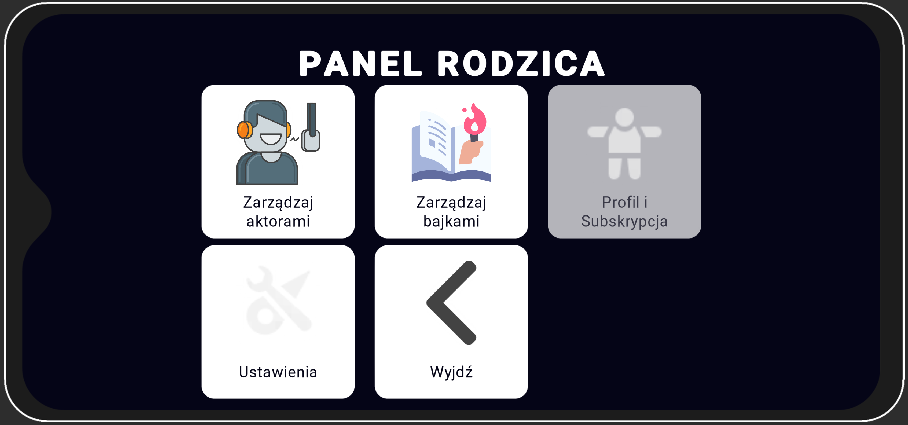
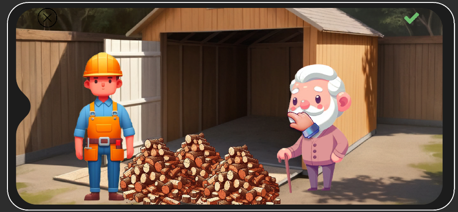
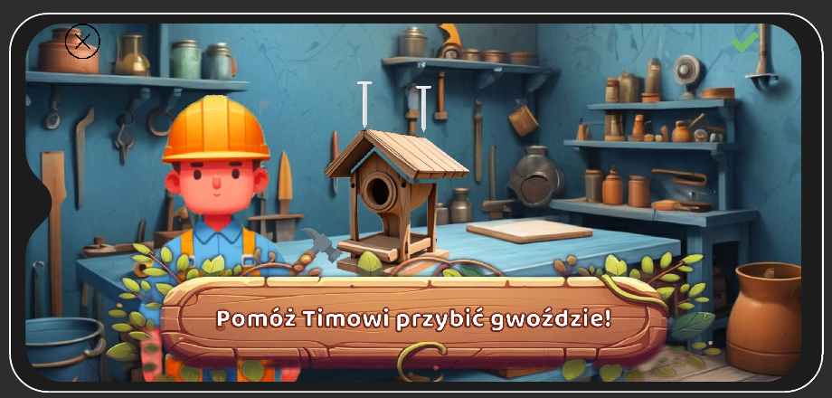

# About Me

Hi! I'm Mariusz, a Unity developer. I have extensive experience in areas such as PC game development, AR mobile app development, and mobile game development in Unity. I've worked on project architecture, game mechanics, UI implementation, bug fixing, performance optimization, and more.

# Commercial Experience

Here are some commercial projects I have worked on, including those that are still live and those that are not available to the public for various reasons.

## "MyBox" (codename) [pre-launch stage] (2022-currently)

A large-scale **free-to-play match-3** game with complex match-3 mechanics and an additional meta-gameplay layer. The project is still **under development** and has not yet been released to stores. In MyBox, I'm one of two **lead programmers**. I'm like a walking bible of the project: there is no place in the code where I haven't left my mark. I'm responsible for project architecture, gameplay mechanics, UI implementation, the in-game shop, internal game core systems, an internal level editor for creating match-3 levels, localization, backend integration, and more.

## "Kraina Wilka" for Orizon Group (2021)

An interactive **AR app** containing several AR mini-games. This app is used as an interactive guide for tours in the area of Lake Solina in Poland. In this project, I was responsible for the **app architecture, AR integration, UI implementation, AR mini-games** implementation, and bug fixing.

Store link: [Kraina Wilka on Google Play](https://play.google.com/store/apps/details?id=com.OrizonStudio.KrainaWilka&hl=en_US)

## "Turystyczny Lublin" for Orizon Group (2021-2022)

An interactive **AR app** containing several AR realistic models of historic city monuments. This app is used as an interactive guide for tours in the city of Lublin in Poland. In this project, I was responsible for the **app architecture, UI implementation, code reviews, and technical consulting**.

Store link: [Turystyczny Lublin on Google Play](https://play.google.com/store/apps/details?id=com.OrizonGroup.TurystycznyLublin&hl=pl&gl=US)

## "Deadliest Catch: The Game" for Moonlit Games (2019-2020)

A PC game launched on Steam, based on the popular TV show "Deadliest Catch". As a Junior Unity Developer, I worked on this project from mid-2019 until early 2020. I was responsible for bug fixing, UI implementation, and game mechanics implementation.

Steam Link: [Deadliest Catch: The Game on Steam](https://store.steampowered.com/app/838630/Deadliest_Catch_The_Game/)

## "SeeMe Stories" for charactr (2020-2021)

A cutting-edge storytelling mobile app with AR elements. This start-up project featured **interactive stories for kids, allowing parents to record voiceovers and character mimics** using the phone camera and Augmented Reality. 

As a Unity Developer on this project, my responsibilities included **co-implementing app flow architecture, UI implementation, story recording functionalities, story playing functionalities, implementing reusable interactive story elements**, and bug fixing.

Despite its huge potential and advanced development stage, the project was shut down in 2021 due to a change in the company's start-up scope. 

Screenshots:

## "Miami English" for Educational Entertainment One (2021-2022)

A start-up project of an educational mobile game focused on learning English. The game featured several language-related educational mini-games, a flashcards mode, and a simple story mode. 

As a Unity Developer on this project, I was responsible for **app flow architecture, UI implementation, mini-games and flashcards module implementation, backend integration**, and bug fixing.

The project was co-funded by a government program and was suspended due company financial issues. 

Screenshots:

# Non-Commercial Experience

Besides commercial projects, I've spent time developing private projects (mostly prototypes and MVPs) to gain more experience in various development areas that Unity offers.

## "Poseidon Framework" and "Poseidon Inseminator"

A codebase that lets me **start my projects quickly**. The framework is equipped with **fundamental elements like a State Machine implementation, popup system, message dispatcher, scene management system, utilities**, and more. The framework is actively used in both commercial projects I've been part of and my private projects. 

"Poseidon Inseminator" is an add-on to the framework base. It's a **custom dependency injection system**, written entirely by me. This system is based on C# reflection and reflection baking techniques. I'm the co-developer of the framework and the developer of the "Inseminator" add-on.

Poseidon Framework: [Repository](https://github.com/Poseidon-tools/PoseidonFramework)

Poseidon Inseminator: [Repository](https://github.com/Poseidon-tools/Poseidon-Inseminator)

## "V1983" (codename) top-down shooter prototype

A hobby project of a top-down shooter, inspired by Hotline Miami and classic top-down shooter games. The project is in the early stages of development with hope for further continuation. I'm developing this project on my own, handling everything from game architecture to UI, game mechanics, and level management.

Video: [YouTube](https://youtu.be/3sWEYHdjPK0)

## "Joy Stories" storytelling app prototype with AI usage

Inspired by "SeeMe Stories," I've created a prototype of another storytelling app with interactive stories for kids. The main difference is allowing parents to **record their voice once** and then **clone** it using Eleven Labs for further automatic voiceover generation. The app is connected to a simple backend created using Firebase and Google Cloud Functions. Every shared story content (scenes, graphics, etc.) is packed into an asset bundle and stored on the backend. 
 
 The app has functionalities for **recording template voices, generating stories, and playing stories**. The app flow is split into two modes: parent (admin) mode and child mode. 
 
App development is now suspended.

Screenshots:

## "Comet Hunter"

A simple utility app developed in Unity. Its purpose is to help analyze images from NASA's SOHO LASCO C3 device, which provides real-time images of the sun. This tool helps analyze images in search of ice comets heading towards the sun.
